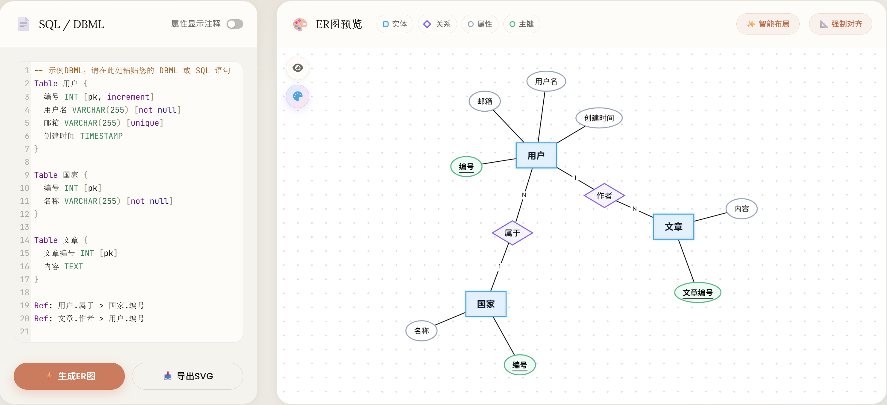
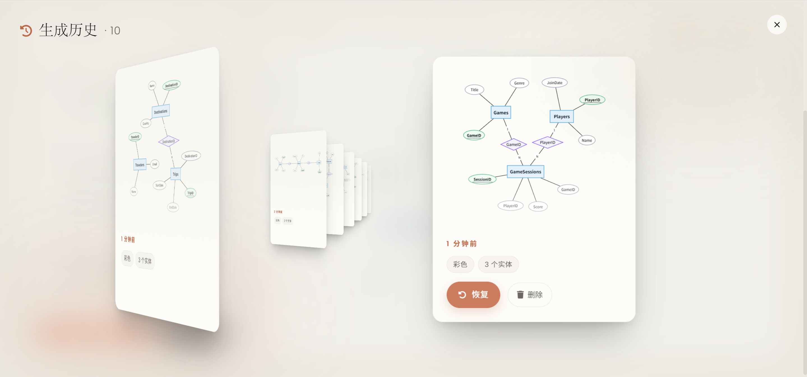

<div align="center">

# 🗂️ The best SQL to ER Diagram Generator

**Elegant online tool to convert SQL / DBML into ER diagrams**

[English](README.en.md) · **Simplified Chinese**

[](./LICENSE)
[](https://github.com/ystemsrx/sql_to_ER/stargazers)
[](https://github.com/ystemsrx/sql_to_ER/network/members)
[](https://github.com/ystemsrx/sql_to_ER/issues)
[](https://github.com/ystemsrx/sql_to_ER/commits)
[](#)
[](#)
[](#)
[](#)
[](#)
[](#)

### 🌐 [**Try Online · Live Demo**](https://ystemsrx.github.io/sql_to_ER/sql2er.html)

</div>

---

## ✨ Overview

A **pure front-end** web tool for generating **Chen-model ER diagrams** from SQL `CREATE TABLE` statements and DBML code. No login, no payment, fully free and open source.

> [!TIP]
> If you need a **logical model** (rather than the Chen model), we recommend [dbdiagram.io](https://dbdiagram.io) — also free.

---

## 🚀 Quick Start

The easiest way — just open the **online version**, no installation needed:

🔗 **[ER Diagram Generator](https://ystemsrx.github.io/sql_to_ER/sql2er.html)**

Or run it locally for development. This project uses [pnpm](https://pnpm.io/) (the version is pinned via the `packageManager` field — `corepack enable` lets Corepack pick it up automatically):

```bash
git clone https://github.com/ystemsrx/sql_to_ER.git
cd sql_to_ER
corepack enable        # one-time, enables Corepack to manage the pnpm version
pnpm install
pnpm dev
```

> [!WARNING]
> **Do not open `sql2er.html` by double-clicking it, and do not run `npx serve .` against the source directory.** This project uses Vite + TypeScript; `.ts/.tsx` files and npm dependencies must be compiled and resolved by Vite. For development, run:
>
> ```bash
> pnpm dev
> ```
>
> Then visit the Vite URL, for example `http://localhost:5173/sql2er.html`. If you want to use a static server, run `pnpm build` first and serve the `dist/` directory.

---

## 📖 Usage

1. Open `sql2er.html` via `pnpm dev` (see Quick Start above, or just use the online demo)
2. Paste your **SQL `CREATE TABLE`** statements or **DBML** code into the input area
3. Click the **"Generate ER Diagram"** button
4. If you are not happy with node positions, **drag nodes** to adjust; **double-click** a node to edit its content
5. On the canvas, use the **scroll wheel** for smooth zoom; hold **Ctrl + scroll wheel** to smoothly rotate the diagram around its center (node shapes and label orientation stay upright)
6. For complex diagrams, drag each rectangle (entity) roughly to the desired position, then click **"Smart Optimization"** to auto-arrange the layout

---

## 🧩 Supported Formats

<details open>
<summary><b>📘 SQL Example</b></summary>

```sql
CREATE TABLE users (
    id INT PRIMARY KEY,
    username VARCHAR(255) NOT NULL,
    email VARCHAR(255) UNIQUE
);

CREATE TABLE posts (
    id INT PRIMARY KEY,
    author_id INT,
    title VARCHAR(255),
    FOREIGN KEY (author_id) REFERENCES users(id)
);
```

</details>

<details open>
<summary><b>📗 DBML Example</b></summary>

```dbml
Table users {
  id INT [pk]
  username VARCHAR(255) [not null]
  email VARCHAR(255) [unique]
}

Table posts {
  id INT [pk]
  author_id INT
  title VARCHAR(255)
}

Ref: posts.author_id > users.id
```

</details>

---

## 🎨 Chen Model Elements

|      Shape       | Meaning            | Database Concept      |
| :--------------: | :----------------- | :-------------------- |
| 🟦 **Rectangle** | Entity             | Table                 |
|  🔶 **Diamond**  | Relationship       | Foreign Key           |
|  ⚪ **Ellipse**  | Attribute          | Column                |
| <u>Underline</u> | Primary Key marker | Primary Key attribute |

---

## ⚖️ Differences from the Standard Chen Model

> [!IMPORTANT]
> For ease of use, this tool deviates from the standard Chen model in the following ways. If you need strict academic correctness, adjust manually per the notes below.

- **Relationship Naming** — The standard Chen model expects diamonds to carry semantic names (e.g., _belongs to_, _owns_). This tool displays the foreign-key field name by default.
- **Entity & Attribute Naming** — The standard recommends business terminology. This tool uses raw database table and column names by default.
- **Custom Editing**
  - ✏️ **Double-click** any graphical element to edit its display content
  - 🔁 Or modify the source (SQL / DBML) and regenerate

---

## 🖼️ Showcase



> [!TIP]
> When the code is complex, the initial diagram may not be tidy. In that case:
>
> 1. Click **"Smart Layout"** for auto-arrangement — this usually produces a reasonably clean result with only minor tweaks needed.
> 2. If still messy, click **"Force Alignment"** for a more aggressive alignment pass, then use "Smart Layout" again for an ideal result.
> 3. In rare cases, **manually** drag the rectangles (entities) to suitable positions (no need to move other elements), then click "Smart Layout".
> 4. **When there are many entities / relationships**, click **"Hide Attributes"** in the top-left of the canvas first, arrange the rectangles (entities) and diamonds (relationships) skeleton into the desired positions, then toggle back to "Show Attributes" — the attributes will automatically redistribute evenly around each rectangle's current position, so they won't get in the way while you drag.

<table>
<tr>
<td width="50%" align="center">
<h4>🔧 Direct Generation</h4>

</td>
<td width="50%" align="center">
<h4>✨ Align + Smart Layout</h4>

</td>
</tr>
</table>

---

## 🕘 Generation History

Every time you generate an ER diagram, a **snapshot** (thumbnail + node positions + current display settings) is auto-saved, so the layout you spent time on doesn't disappear when you regenerate.



- **Open** — click the **🕘 clock icon** in the top-left of the canvas to open the history page.
- **Browse** — **drag** the cards or use the **scroll wheel** on the panel; the most recent snapshot sits in front.
- **Restore** — drag any card to snap it to the center; clicking *Restore* then rebuilds the diagram with the saved node positions / labels (no re-layout).
- **Delete** — the **🗑** button on each card removes just that snapshot.
- **Persistence** — everything lives in your browser's **IndexedDB** (entries appear only after you generate a non-sample diagram).

> [!TIP]
> Need to undo your last manual tweak? *Restore* swaps to a different archived input; for fine-grained step-by-step undo / redo use **Ctrl + Z / Ctrl + Y**.

---

## 🤝 Contributing

Issues and Pull Requests are welcome! If this project helps you, please leave a ⭐ Star — it really motivates further work.

---

## 📄 License

Released under the [MIT License](./LICENSE).
